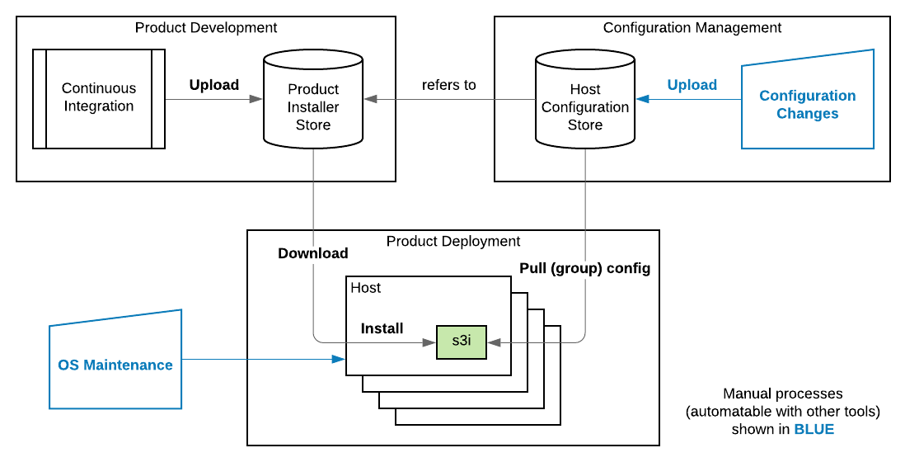

# s3i - MSI Package Batch Installer 

This is a simple learning project I created to become familiar with .NET Core 3.0, 
and Windows/Linux project and binary portability. 

Also, it gives an example of using certain features 
like continuous integrations with [AppVeyor](https://appveyor.com), 
and continuous deployment to Windows computers from [GitHub Releases](https://help.github.com/en/github/administering-a-repository/about-releases) - 
all completely free for open source projects! For private projects, a secure storage, 
like AWS S3 can be used for storing configuration and/or software installers.

## Functionality

s3i is a small Windows command line utility and service for managing Windows Installer packages products (in *.msi files) on groups of computers. Each managed host has s3i installed and configured for polling of group-specific configuration file. Changes of this file _eventually (on installed software request)_ result in products being installed, reconfigured, upgraded, downgraded or uninstalled - on all computers in the same group. Configuration files specify product installation source and set of property values to apply at installation. Both configuration files and installation sources can be served locally (or from UNC), from public Web site (like GitHub Releases), or from AWS S3 bucket.

In essence, s3i is a simple Continuous Deployment complement for already established Continuous Integration system (this project itself is an example of such)

Detailed desription can be found in [wiki](https://github.com/OlegBoulanov/s3i/wiki)

## Build Status

|  master | develop |release |
|:-------:|:------:|:-------:|
||||

## Installation Prerequisites

- Windows 10/* (comes with [Windows Installer](https://docs.microsoft.com/en-us/windows/win32/msi/overview-of-windows-installer))
   - [.NET 6.0](https://dotnet.microsoft.com/en-us/download/dotnet/6.0) Runtime installed

## Installation 

Latest version of `s3i.msi` can be installed from [Releases page](https://github.com/OlegBoulanov/s3i/releases/latest)

## Project maintenance
### Integration with Github and AppVeyor: token change
- git config --global credential.helper store
- git clone https<notatag>://OlegBoulanov:**github-token-for-appveyor**@github.com/OlegBoulanov/s3i
### Making release
- Push/merge to release branch
- New version artifacts will be uploaded here: https://github.com/OlegBoulanov/s3i/releases

